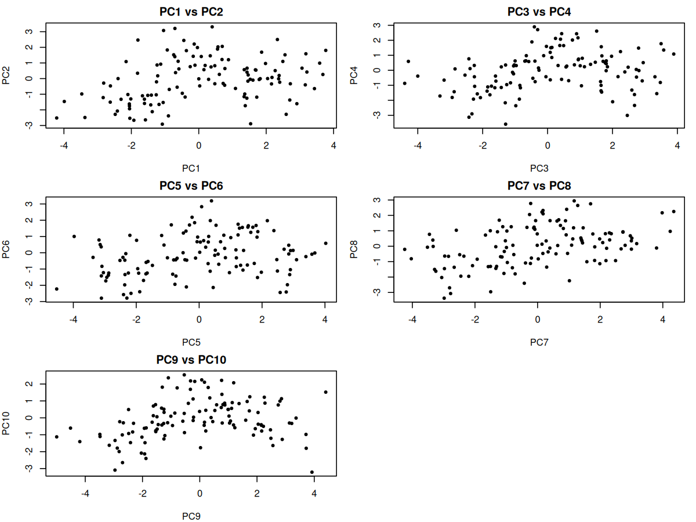
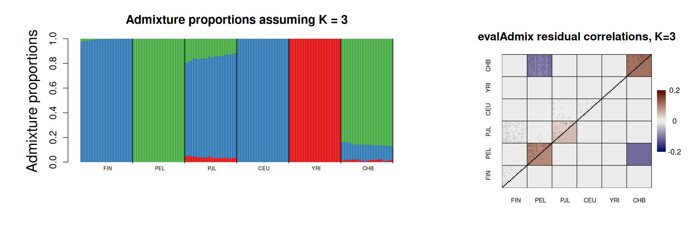
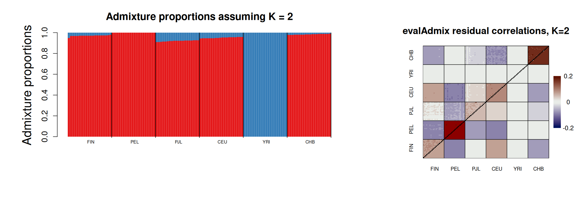
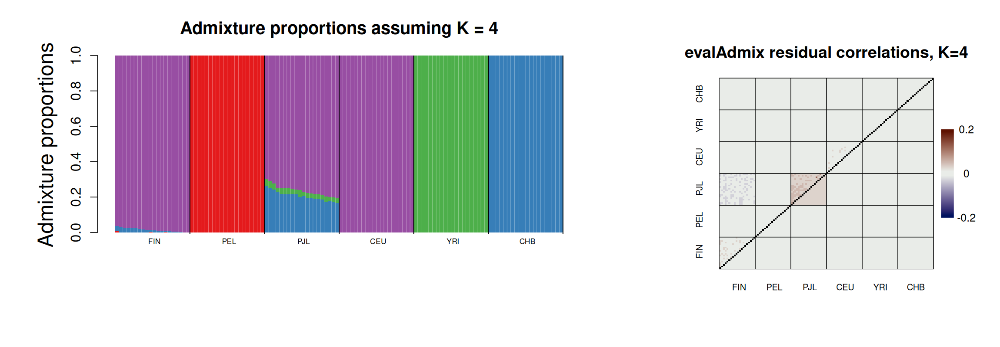
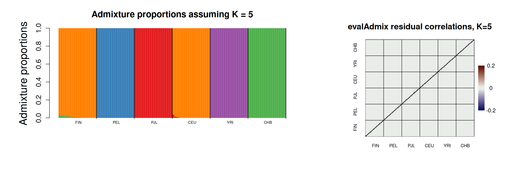
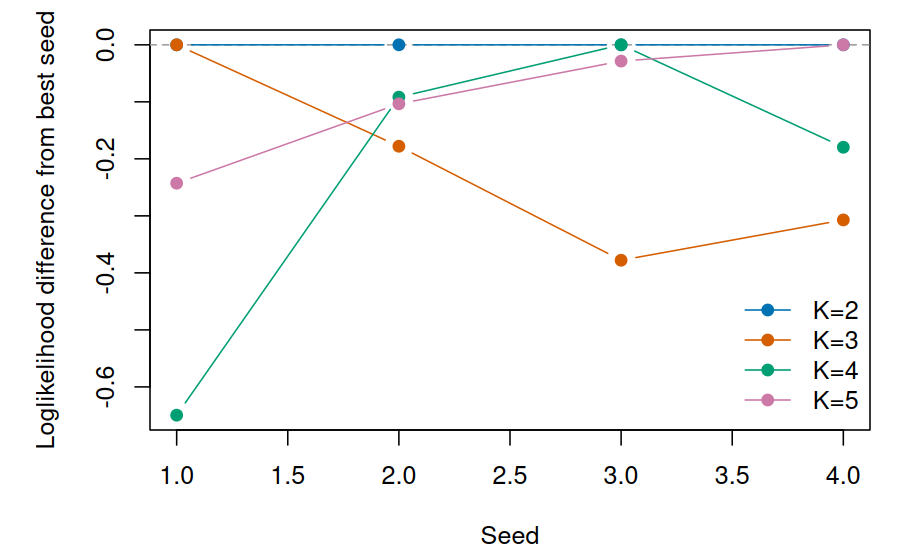
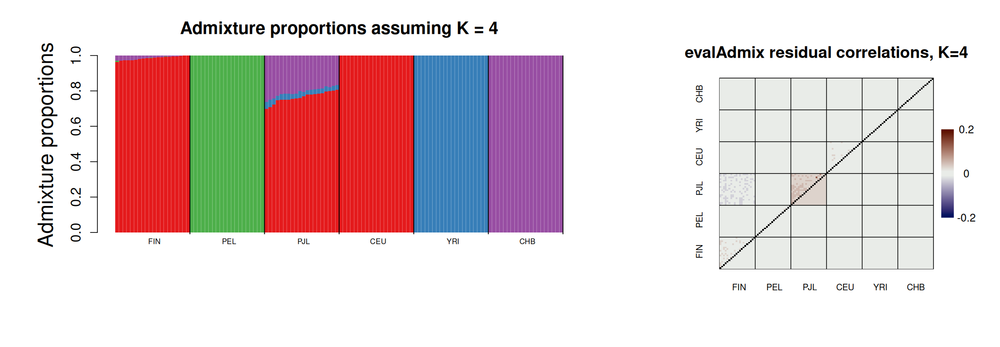
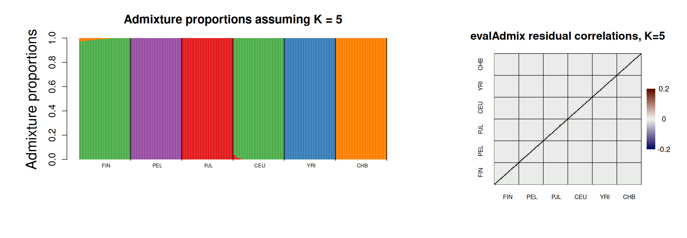

# ADMIXTURE tutorial

This tutorial estimates ancestry proportions from called genotypes using ADMIXTURE. It complements the NGSadmix tutorial, which uses genotype likelihoods from low-depth sequencing data.

## Learning goals

- Prepare called genotype data for ADMIXTURE.
- Apply basic genotype QC with a 5% MAF cutoff and 1% missing-genotype cutoff.
- Use the first five meaningful PCAone PCs to test HWE while accounting for population structure.
- Use the first five meaningful PCAone PCs for ancestry-adjusted LD pruning before ancestry inference.
- Run ADMIXTURE for several values of `K` and several random seeds to check convergence.
- Plot ancestry proportions from ADMIXTURE `Q` files.
- Visualize the top 10 PCs as PC1 vs PC2, PC3 vs PC4, and so on.
- Use convergence checks and evalAdmix residuals, not cross-validation, to evaluate which `K` values are useful.

## Input data

This tutorial uses a called-genotype data set in PLINK binary format. The data set contains 120 individuals from six 1000 Genomes populations and 6,676,750 autosomal SNPs before filtering.

| Population | Description | Individuals |
| --- | --- | ---: |
| CEU | Utah residents with Northern/Western European ancestry | 20 |
| CHB | Han Chinese in Beijing | 20 |
| FIN | Finnish in Finland | 20 |
| PEL | Peruvian in Lima, Peru | 20 |
| PJL | Punjabi in Lahore, Pakistan | 20 |
| YRI | Yoruba in Ibadan, Nigeria | 20 |

Download the data into the local `data/` folder. The files are served from:

```text
https://popgen.dk/albrecht/open/tutorial_data/admixture/
```

## Set up folders and download data

Run all commands from the `admixture/` folder.

```bash
DATA_URL=https://popgen.dk/albrecht/open/tutorial_data/admixture

mkdir -p data results figures software
```

<details>
<summary>stdout</summary>

```text
No stdout is expected.
```

</details>

Download the data if they are not already present:

```bash
if [ ! -s data/example.bed ]
then
  wget -nc -P data "${DATA_URL}/example.bed"
  wget -nc -P data "${DATA_URL}/example.bim"
  wget -nc -P data "${DATA_URL}/example.fam"
fi
```

<details>
<summary>stdout</summary>

```text
If data/example.bed already exists, no stdout is expected.
If the files are missing, wget prints one download status line per file.
```

</details>

<details>
<summary>Install software</summary>

ADMIXTURE documentation: https://dalexander.github.io/admixture/

PLINK documentation: https://www.cog-genomics.org/plink/

PCAone documentation: https://github.com/Zilong-Li/PCAone

evalAdmix documentation: https://github.com/GenisGE/evalAdmix

ImageMagick documentation: https://imagemagick.org/

Install locally under `software/`. Each block checks whether the executable is already present before downloading anything. ImageMagick is used only to join the ADMIXTURE and evalAdmix PNG files into one side-by-side figure.

```bash
if [ ! -x software/dist/admixture_linux-1.3.0/admixture ]
then
  curl -L https://dalexander.github.io/admixture/binaries/admixture_linux-1.3.0.tar.gz \
    -o software/admixture_linux-1.3.0.tar.gz
  tar -xzf software/admixture_linux-1.3.0.tar.gz -C software
fi

if [ ! -x software/plink/plink ]
then
  curl -L https://s3.amazonaws.com/plink1-assets/plink_linux_x86_64_20241022.zip \
    -o software/plink_linux_x86_64_20241022.zip
  unzip -n software/plink_linux_x86_64_20241022.zip -d software/plink
fi

if [ ! -x software/PCAone ]
then
  curl -L https://github.com/Zilong-Li/PCAone/releases/latest/download/PCAone-Linux.zip \
    -o software/PCAone-Linux.zip
  unzip -n software/PCAone-Linux.zip -d software
  chmod +x software/PCAone
fi

if [ ! -x software/evalAdmix/evalAdmix ]
then
  git clone https://github.com/GenisGE/evalAdmix.git software/evalAdmix
  make -C software/evalAdmix
fi

if ! command -v magick >/dev/null
then
  sudo apt-get update
  sudo apt-get install -y imagemagick
fi

software/dist/admixture_linux-1.3.0/admixture --help >/dev/null || true
software/plink/plink --help >/dev/null || true
software/PCAone --help >/dev/null || true
software/evalAdmix/evalAdmix 2>&1 | head
command -v magick
```

<details>
<summary>stdout</summary>

```text
The install commands only print download, unzip, make, and help text when software is missing.
If the software is already installed, the final commands print short help/version text.
/usr/bin/magick
```

</details>

</details>

## Prepare input

### 1. Filter on MAF and missing genotypes

First inspect the input data and apply simple genotype filters. The MAF cutoff removes rare variants that are not informative for this small teaching example. The missingness cutoff removes SNPs with more than 1% missing genotypes. These thresholds are reasonable here, but they are not universal; choose them based on sample size, genotyping technology, and the downstream question.

```bash
software/plink/plink --bfile data/example \
  --maf 0.05 \
  --geno 0.01 \
  --make-bed \
  --out results/example.qc
```

<details>
<summary>Example stdout</summary>

```text
PLINK v1.9
6676750 variants loaded from .bim file.
120 people (0 males, 0 females, 120 ambiguous) loaded from .fam.
--geno: 0 variants removed due to missing genotype data.
--maf: 0 variants removed due to minor allele frequency threshold.
6676750 variants and 120 people pass filters and QC.
--make-bed to results/example.qc.bed + results/example.qc.bim + results/example.qc.fam ... done.
```

</details>

This data set has population structure, so we do not use PLINK for LD pruning. Standard LD estimates can be confounded by ancestry differences. Instead, we use PCAone to estimate PCs, test HWE while accounting for structure, and prune using ancestry-adjusted LD.

### 2. Estimate and visualize PCs with PCAone

First run PCAone and save the top 10 PCs and SNP loadings. The PCs are later plotted to show whether the sample labels match the major axes of structure.

```bash
software/PCAone -b results/example.qc -k 10 -V -o results/example.pcaone_plot
```

<details>
<summary>Example stdout</summary>

```text
PCAone (v0.6.0)
N (# samples): 120, M (# SNPs): 6676750
running of epoch =  6, diff = 1.19257e-05
stops at epoch =  7
eigen vectors and values saved
PCAone - Randomized SVD done
total elapsed wall time: 118.371 seconds
```

</details>

For visualization, use `results/example.pcaone_plot.eigvecs2`, not the raw eigenvector matrix. PCAone's `eigvecs2` file is the plotting-friendly output with sample IDs and PC columns.

The PCA plot below was made directly from `results/example.pcaone_plot.eigvecs2`.

<details>
<summary>R code used to plot the PCAone PCs</summary>

```r
results_dir <- "results"
figures_dir <- "figures"
dir.create(figures_dir, showWarnings = FALSE, recursive = TRUE)

pcs <- read.table(
  file.path(results_dir, "example.pcaone_plot.eigvecs2"),
  header = TRUE,
  check.names = FALSE,
  comment.char = ""
)

fam <- read.table(file.path(results_dir, "example.qc.fam"), as.is = TRUE)
names(fam)[1:2] <- c("#FID", "IID")

pop <- fam[match(pcs$IID, fam$IID), "#FID"]
pop <- factor(pop)
pop_cols <- setNames(
  c("#0072B2", "#D55E00", "#009E73", "#CC79A7", "#E69F00", "#56B4E9")[seq_along(levels(pop))],
  levels(pop)
)

png(file.path(figures_dir, "pcaone_top10_pc_pairs.png"), width = 1200, height = 900, res = 150)
par(mfrow = c(3, 2), mar = c(4, 4, 2, 1))

for (i in seq(1, 9, by = 2)) {
  plot(
    pcs[[paste0("PC", i)]],
    pcs[[paste0("PC", i + 1)]],
    pch = 19,
    cex = 0.65,
    col = pop_cols[as.character(pop)],
    xlab = paste0("PC", i),
    ylab = paste0("PC", i + 1),
    main = paste0("PC", i, " vs PC", i + 1)
  )
}

plot.new()
legend("center", legend = levels(pop), col = pop_cols, pch = 19, bty = "n", title = "Population")
dev.off()
```

</details>

<details>
<summary>stdout</summary>

```text
null device
1
```

</details>



Figure 1. PCAone PC plots for PC1 vs PC2, PC3 vs PC4, PC5 vs PC6, PC7 vs PC8, and PC9 vs PC10. Points are colored by the population label in the `.fam` file. In this data set the first five PCs describe the main population structure. PC6 mainly captures a related pair of individuals rather than a broad population axis. Later PCs look noisier because, after the main population structure has been removed, the remaining axes describe weaker structure, within-population variation, relatedness, and outliers.

### 3. HWE filtering and ancestry-adjusted LD pruning

Next use the first five meaningful PCAone PCs/loadings to test HWE while accounting for population structure. The `.hwe` file contains one row per SNP, including an HWE P value and inbreeding coefficient `F`. With many individuals, very small HWE deviations can become statistically significant, so filtering only on the P value can remove SNPs with negligible practical deviation. Here we remove SNPs with `HWE_P <= 1e-6` and an appreciable deviation, `F <= -0.05` or `F >= 0.05`, then make a new PLINK data set before LD pruning. These thresholds depend on the data set and study design.

```bash
software/PCAone -b results/example.qc \
  -k 5 \
  --inbreed 1 \
  -o results/example.hwe
```

<details>
<summary>stdout</summary>

```text
PCAone --inbreed 1
N (# samples): 120, M (# SNPs): 6676750
run inbreeding coefficient estimator
EM inbreeding coefficient coverged
compute the LRT test
Output: results/example.hwe.hwe
```

</details>

```bash
awk 'NR > 1 && !($2 <= 1e-6 && ($4 <= -0.05 || $4 >= 0.05)) {print $1}' \
  results/example.hwe.hwe > results/example.hwe.keep
```

<details>
<summary>stdout</summary>

```text
No stdout is expected. The retained SNP IDs are written to results/example.hwe.keep.
```

</details>

```bash
software/plink/plink --bfile results/example.qc \
  --extract results/example.hwe.keep \
  --make-bed \
  --out results/example.hwe_filtered
```

<details>
<summary>stdout</summary>

```text
--extract: 6651790 variants remaining.
6651790 variants and 120 people pass filters and QC.
--make-bed to results/example.hwe_filtered.bed + results/example.hwe_filtered.bim + results/example.hwe_filtered.fam ... done.
```

</details>

Now compute ancestry-adjusted LD on the HWE-filtered data using the first five PCs and prune SNPs with `r2 > 0.2` within 1 Mb. PCAone writes `results/example.adjld.ld.prune.in`, the SNPs retained after adjusted-LD pruning.

```bash
software/PCAone -b results/example.hwe_filtered -k 5 --ld -o results/example.adjld
```

<details>
<summary>stdout</summary>

```text
shape of input matrix (features x samples) is 6651790x 120
ld-stats=0: calculate the ancestry adjusted LD matrix
the LD matrix and SNPs info are saved
Output: results/example.adjld.residuals
```

</details>

```bash
software/PCAone -B results/example.adjld.residuals \
  --match-bim results/example.adjld.mbim \
  --ld-r2 0.2 \
  --ld-bp 1000000 \
  -o results/example.adjld
```

<details>
<summary>stdout</summary>

```text
LD pruning, choose sites to be kept randomly or with high MAF? 1(random) : 0(high MAF). => 0
Output: results/example.adjld.ld.prune.in
Output: results/example.adjld.ld.prune.out
```

</details>

Finally, extract the PCAone LD-pruned SNP IDs and create the PLINK data set used by ADMIXTURE.

```bash
awk '{print $2}' results/example.adjld.ld.prune.in > results/example.adjld.ld.prune.ids
```

<details>
<summary>stdout</summary>

```text
No stdout is expected. SNP IDs are written to results/example.adjld.ld.prune.ids.
```

</details>

```bash

software/plink/plink --bfile results/example.hwe_filtered \
  --extract results/example.adjld.ld.prune.ids \
  --make-bed \
  --out results/example.pcaone_pruned
```

<details>
<summary>stdout</summary>

```text
6651790 variants loaded from .bim file.
120 people (0 males, 0 females, 120 ambiguous) loaded from .fam.
--extract: 259140 variants remaining.
259140 variants and 120 people pass filters and QC.
--make-bed to results/example.pcaone_pruned.bed + results/example.pcaone_pruned.bim + results/example.pcaone_pruned.fam ... done.
```

</details>

## Run ADMIXTURE

### 1. Start with one K=3 run

First run ADMIXTURE once with `K=3` and a fixed seed. This gives a first ancestry plot to inspect before running many K values or many seeds.

```bash
software/dist/admixture_linux-1.3.0/admixture -s 1 results/example.pcaone_pruned.bed 3 \
  > results/admixture.K3.seed1.log

mv example.pcaone_pruned.3.Q results/example.pcaone_pruned.K3.seed1.Q
mv example.pcaone_pruned.3.P results/example.pcaone_pruned.K3.seed1.P
```

<details>
<summary>stdout</summary>

```text
ADMIXTURE Version 1.3.0
Random seed: 1
Size of G: 120x259140
Converged in 18 iterations (55.711 sec)
Loglikelihood: -26467079.878156
Fst divergences between estimated populations:
        Pop0    Pop1
Pop0
Pop1    0.173
Pop2    0.206   0.100
Writing output files.
```

</details>

### 2. Check K=3 convergence with multiple seeds

After the first K=3 run, run K=3 with multiple seeds and stop when the runs have converged. This follows the logic in `multiConv_ADMIXTURE.sh`: save one loglikelihood per seed, sort likelihoods from best to worst, test whether enough runs are close to the best likelihood, and also test whether the Q matrices are visually indistinguishable.

```bash
K=3
MAX_SEEDS=10
CONV_TIMES=3
LL_DIFF=3
Q_DIFF=0.01
LIKE_TMP="results/admixture.K${K}.likes.tmp"
LIKE_FILE="results/admixture.K${K}.likes"
QLIST="results/admixture.K${K}.Qlist"
: > "${LIKE_TMP}"
: > "${QLIST}"

for SEED in $(seq 1 "${MAX_SEEDS}")
do
  QOUT="results/example.pcaone_pruned.K${K}.seed${SEED}.Q"
  POUT="results/example.pcaone_pruned.K${K}.seed${SEED}.P"
  LOG="results/admixture.K${K}.seed${SEED}.log"

  software/dist/admixture_linux-1.3.0/admixture -s "${SEED}" \
    results/example.pcaone_pruned.bed "${K}" > "${LOG}"

  mv "example.pcaone_pruned.${K}.Q" "${QOUT}"
  mv "example.pcaone_pruned.${K}.P" "${POUT}"

  LOG_LIK=$(awk '/^Loglikelihood:/ {ll=$2} END {print ll}' "${LOG}")
  awk -v seed="${SEED}" -v ll="${LOG_LIK}" '$1 != seed {print} END {print seed, ll}' \
    "${LIKE_TMP}" > "${LIKE_TMP}.tmp"
  mv "${LIKE_TMP}.tmp" "${LIKE_TMP}"
  awk -v qout="${QOUT}" '$1 != qout {print} END {print qout}' \
    "${QLIST}" > "${QLIST}.tmp"
  mv "${QLIST}.tmp" "${QLIST}"
  sort -k2,2nr "${LIKE_TMP}" > "${LIKE_FILE}"

  awk '{print $2}' "${LIKE_TMP}" > "results/ll.K${K}.${SEED}.txt"
  CONV=$(awk -v diff="${LL_DIFF}" 'NR == 1 {best=$2} best - $2 < diff {n++} END {print n + 0}' "${LIKE_FILE}")
  CONV2=$(Rscript code/testQconv.R "results/ll.K${K}.${SEED}.txt" "${QLIST}" "${Q_DIFF}")
  echo "K=${K} seed=${SEED} likelihood_converged=${CONV} q_converged=${CONV2}"
  if [ "${CONV}" -gt "${CONV_TIMES}" ] || [ "${CONV2}" -gt "${CONV_TIMES}" ]
  then
    break
  fi
done
```

<details>
<summary>stdout</summary>

```text
K=3 seed=1 likelihood_converged=1 q_converged=1
K=3 seed=2 likelihood_converged=2 q_converged=2
K=3 seed=3 likelihood_converged=3 q_converged=3
K=3 seed=4 likelihood_converged=4 q_converged=4
```

</details>

Run evalAdmix on the same `K=3` result. evalAdmix estimates residual correlations between individuals after fitting the ancestry model. Positive residual-correlation blocks show pairs of individuals that are more similar than expected under the fitted `K`, which often means the model has not captured all structure.

```bash
software/evalAdmix/evalAdmix \
  -plink results/example.pcaone_pruned \
  -fname results/example.pcaone_pruned.K3.seed1.P \
  -qname results/example.pcaone_pruned.K3.seed1.Q \
  -o results/evaladmix.K3.seed1.corres \
  -P 4
```

<details>
<summary>stdout</summary>

```text
evalAdmix version 1.0
Plink file contains 259140 autosomale SNPs
K=3 nSites=259140 nInd=120
Correlation matrix has been written to results/evaladmix.K3.seed1.corres
walltime used = 30.00 sec
```

</details>

Plot the single-K result. The residual heatmap uses the evalAdmix plotting functions from `code/visFuns.R`.

<details>
<summary>R code used to plot ADMIXTURE K=3 and evalAdmix K=3</summary>

```r
source(file.path("code", "visFuns.R"))

results_dir <- "results"
figures_dir <- "figures"
dir.create(figures_dir, showWarnings = FALSE, recursive = TRUE)

fam <- read.table(file.path(results_dir, "example.pcaone_pruned.fam"), as.is = TRUE)
pop <- fam[, 1]

q <- read.table(file.path(results_dir, "example.pcaone_pruned.K3.seed1.Q"))
ord <- orderInds(pop = as.vector(pop), q = q)

png(file.path(figures_dir, "admixture_k3.png"), width = 1400, height = 700, res = 160)
par(mar = c(5, 7, 4, 2))
plotAdmix(q, ord = ord, pop = pop, cex.lab = 0.7)
dev.off()

r <- as.matrix(read.table(file.path(results_dir, "evaladmix.K3.seed1.corres")))
png(file.path(figures_dir, "evaladmix_k3_seed1.png"), width = 900, height = 800, res = 150)
plotCorRes(
  cor_mat = r,
  pop = as.vector(pop),
  ord = ord,
  title = "evalAdmix residual correlations, K=3",
  min_z = -0.2,
  max_z = 0.2,
  cex.lab = 0.8,
  cex.legend = 1
)
dev.off()

system2(
  "magick",
  c(
    file.path(figures_dir, "admixture_k3.png"),
    file.path(figures_dir, "evaladmix_k3_seed1.png"),
    "+append",
    file.path(figures_dir, "admixture_evaladmix_k3_seed1.png")
  )
)
```

</details>

<details>
<summary>stdout</summary>

```text
null device
1
```

</details>



Figure 2. ADMIXTURE ancestry barplot and evalAdmix residual-correlation heatmap for `K=3`, seed 1. Each vertical bar is one individual, and colors show inferred ancestry components. Residual blocks indicate structure that is not fully captured by this fitted model.

### 3. Run and visualize multiple K values

Next run one seed for several K values and evaluate each K with evalAdmix.

```bash
for K in 2 3 4 5
do
  software/dist/admixture_linux-1.3.0/admixture -s 1 results/example.pcaone_pruned.bed "${K}" \
    > "results/admixture.K${K}.seed1.log"

  mv "example.pcaone_pruned.${K}.Q" "results/example.pcaone_pruned.K${K}.seed1.Q"
  mv "example.pcaone_pruned.${K}.P" "results/example.pcaone_pruned.K${K}.seed1.P"

  software/evalAdmix/evalAdmix \
    -plink results/example.pcaone_pruned \
    -fname "results/example.pcaone_pruned.K${K}.seed1.P" \
    -qname "results/example.pcaone_pruned.K${K}.seed1.Q" \
    -o "results/evaladmix.K${K}.seed1.corres" \
    -P 4
done
```

<details>
<summary>stdout</summary>

```text
ADMIXTURE writes one log file per K:
results/admixture.K2.seed1.log
results/admixture.K3.seed1.log
results/admixture.K4.seed1.log
results/admixture.K5.seed1.log

evalAdmix writes one residual-correlation matrix per K:
results/evaladmix.K2.seed1.corres
results/evaladmix.K3.seed1.corres
results/evaladmix.K4.seed1.corres
results/evaladmix.K5.seed1.corres
```

</details>

Plot the ADMIXTURE and evalAdmix output for each K. The evalAdmix residual plots use `plotCorRes()` from `code/visFuns.R`.

<details>
<summary>R code used to plot multiple K values</summary>

```r
source(file.path("code", "visFuns.R"))

results_dir <- "results"
figures_dir <- "figures"
fam <- read.table(file.path(results_dir, "example.pcaone_pruned.fam"), as.is = TRUE)
pop <- fam[, 1]

for (K in 2:5) {
  q <- read.table(file.path(results_dir, sprintf("example.pcaone_pruned.K%s.seed1.Q", K)))
  ord <- orderInds(pop = as.vector(pop), q = q)

  png(file.path(figures_dir, sprintf("admixture_k%s.png", K)), width = 1400, height = 700, res = 160)
  par(mar = c(5, 7, 4, 2))
  plotAdmix(q, ord = ord, pop = pop, cex.lab = 0.7)
  dev.off()

  r <- as.matrix(read.table(file.path(results_dir, sprintf("evaladmix.K%s.seed1.corres", K))))
  png(file.path(figures_dir, sprintf("evaladmix_k%s_seed1.png", K)), width = 900, height = 800, res = 150)
  plotCorRes(
    cor_mat = r,
    pop = as.vector(pop),
    ord = ord,
    title = sprintf("evalAdmix residual correlations, K=%s", K),
    min_z = -0.2,
    max_z = 0.2,
    cex.lab = 0.8,
    cex.legend = 1
  )
  dev.off()

  system2(
    "magick",
    c(
      file.path(figures_dir, sprintf("admixture_k%s.png", K)),
      file.path(figures_dir, sprintf("evaladmix_k%s_seed1.png", K)),
      "+append",
      file.path(figures_dir, sprintf("admixture_evaladmix_k%s_seed1.png", K))
    )
  )
}
```

</details>

<details>
<summary>stdout</summary>

```text
null device
1
```

</details>








Figure 3. ADMIXTURE ancestry barplots and evalAdmix residual-correlation heatmaps for `K=2..5`, seed 1. These plots are for visual inspection; the meaningful `K` is not the K with the best cross-validation score. Compare residual blocks across K values; a useful K should reduce systematic residual structure without simply adding unstable components. At `K=5`, evalAdmix also captures the same related pair that appears on PC6, visible as a small pairwise residual signal rather than a population-wide block.

### 4. Run multiple seeds for multiple K values

Different seeds can converge to different optima, especially for larger `K`. The same convergence logic can be applied across multiple K values. The loop below records final loglikelihoods, keeps a list of Q matrices, and stops each K when enough runs satisfy either the likelihood criterion or the Q-matrix criterion.

```bash
MAX_SEEDS=${MAX_SEEDS:-10}
CONV_TIMES=3
LL_DIFF=3
Q_DIFF=0.01

for K in 2 3 4 5
do
  LIKE_TMP="results/admixture.K${K}.likes.tmp"
  LIKE_FILE="results/admixture.K${K}.likes"
  QLIST="results/admixture.K${K}.Qlist"
  : > "${LIKE_TMP}"
  : > "${QLIST}"

  for SEED in $(seq 1 "${MAX_SEEDS}")
  do
    QOUT="results/example.pcaone_pruned.K${K}.seed${SEED}.Q"
    POUT="results/example.pcaone_pruned.K${K}.seed${SEED}.P"
    LOG="results/admixture.K${K}.seed${SEED}.log"

    software/dist/admixture_linux-1.3.0/admixture -s "${SEED}" \
      results/example.pcaone_pruned.bed "${K}" > "${LOG}"

    mv "example.pcaone_pruned.${K}.Q" "${QOUT}"
    mv "example.pcaone_pruned.${K}.P" "${POUT}"

    LOG_LIK=$(awk '/^Loglikelihood:/ {ll=$2} END {print ll}' "${LOG}")
    awk -v seed="${SEED}" -v ll="${LOG_LIK}" '$1 != seed {print} END {print seed, ll}' \
      "${LIKE_TMP}" > "${LIKE_TMP}.tmp"
    mv "${LIKE_TMP}.tmp" "${LIKE_TMP}"
    awk -v qout="${QOUT}" '$1 != qout {print} END {print qout}' \
      "${QLIST}" > "${QLIST}.tmp"
    mv "${QLIST}.tmp" "${QLIST}"
    sort -k2,2nr "${LIKE_TMP}" > "${LIKE_FILE}"

    awk '{print $2}' "${LIKE_TMP}" > "results/ll.K${K}.${SEED}.txt"
    CONV=$(awk -v diff="${LL_DIFF}" 'NR == 1 {best=$2} best - $2 < diff {n++} END {print n + 0}' "${LIKE_FILE}")
    CONV2=$(Rscript code/testQconv.R "results/ll.K${K}.${SEED}.txt" "${QLIST}" "${Q_DIFF}")
    echo "K=${K} seed=${SEED} likelihood_converged=${CONV} q_converged=${CONV2}"
    if [ "${CONV}" -gt "${CONV_TIMES}" ] || [ "${CONV2}" -gt "${CONV_TIMES}" ]
    then
      break
    fi
  done

  BEST_SEED=$(awk 'NR == 1 {print $1}' "${LIKE_FILE}")
  software/evalAdmix/evalAdmix \
    -plink results/example.pcaone_pruned \
    -fname "results/example.pcaone_pruned.K${K}.seed${BEST_SEED}.P" \
    -qname "results/example.pcaone_pruned.K${K}.seed${BEST_SEED}.Q" \
    -o "results/evaladmix.K${K}.best.corres" \
    -P 4
done
```

<details>
<summary>stdout</summary>

```text
K=2 seed=1 likelihood_converged=1 q_converged=1
K=2 seed=2 likelihood_converged=2 q_converged=2
K=2 seed=3 likelihood_converged=3 q_converged=3
K=2 seed=4 likelihood_converged=4 q_converged=4
K=3 seed=1 likelihood_converged=1 q_converged=1
K=3 seed=2 likelihood_converged=2 q_converged=2
K=3 seed=3 likelihood_converged=3 q_converged=3
K=3 seed=4 likelihood_converged=4 q_converged=4
K=4 seed=1 likelihood_converged=1 q_converged=1
K=4 seed=2 likelihood_converged=2 q_converged=2
K=4 seed=3 likelihood_converged=3 q_converged=3
K=4 seed=4 likelihood_converged=4 q_converged=4
K=5 seed=1 likelihood_converged=1 q_converged=1
K=5 seed=2 likelihood_converged=2 q_converged=2
K=5 seed=3 likelihood_converged=3 q_converged=3
K=5 seed=4 likelihood_converged=4 q_converged=4
```

</details>

<details>
<summary>Example ADMIXTURE log</summary>

```text
ADMIXTURE Version 1.3.0
Random seed: 1
Size of G: 120x259140
Converged in 18 iterations (55.711 sec)
Loglikelihood: -26467079.878156
Fst divergences between estimated populations:
        Pop0    Pop1
Pop0
Pop1    0.173
Pop2    0.206   0.100
Writing output files.
```

</details>

Do not choose the meaningful `K` from cross-validation error. Use convergence across seeds, ancestry plots, and evalAdmix residuals.

<details>
<summary>R code used to plot convergence and best-seed evalAdmix results</summary>

```r
source(file.path("code", "visFuns.R"))

results_dir <- "results"
figures_dir <- "figures"
fam <- read.table(file.path(results_dir, "example.pcaone_pruned.fam"), as.is = TRUE)
pop <- fam[, 1]

likes_files <- list.files(results_dir, pattern = "^admixture\\.K[0-9]+\\.likes$", full.names = TRUE)
conv <- do.call(rbind, lapply(likes_files, function(path) {
  K <- as.integer(sub("^admixture\\.K([0-9]+)\\.likes$", "\\1", basename(path)))
  x <- read.table(path, col.names = c("seed", "loglikelihood"))
  data.frame(K = K, seed = x$seed, loglikelihood = x$loglikelihood)
}))
conv <- conv[order(conv$K, conv$seed), ]
conv$delta_best <- ave(conv$loglikelihood, conv$K, FUN = function(x) x - max(x))

png(file.path(figures_dir, "admixture_convergence.png"), width = 900, height = 550, res = 150)
plot(
  range(conv$seed),
  range(conv$delta_best),
  type = "n",
  xlab = "Seed",
  ylab = "Loglikelihood difference from best seed"
)
abline(h = 0, lty = 2, col = "grey60")
cols <- setNames(c("#0072B2", "#D55E00", "#009E73", "#CC79A7"), sort(unique(conv$K)))
for (K in sort(unique(conv$K))) {
  x <- conv[conv$K == K, ]
  lines(x$seed, x$delta_best, type = "b", pch = 19, col = cols[as.character(K)])
}
legend("bottomright", legend = paste0("K=", sort(unique(conv$K))), col = cols, pch = 19, lty = 1, bty = "n")
dev.off()

for (K in 2:5) {
  likes <- read.table(file.path(results_dir, sprintf("admixture.K%s.likes", K)), col.names = c("seed", "loglikelihood"))
  best_seed <- likes$seed[1]
  q <- read.table(file.path(results_dir, sprintf("example.pcaone_pruned.K%s.seed%s.Q", K, best_seed)))
  ord <- orderInds(pop = as.vector(pop), q = q)

  png(file.path(figures_dir, sprintf("admixture_k%s_best.png", K)), width = 1400, height = 700, res = 160)
  par(mar = c(5, 7, 4, 2))
  plotAdmix(q, ord = ord, pop = pop, cex.lab = 0.7)
  dev.off()

  r <- as.matrix(read.table(file.path(results_dir, sprintf("evaladmix.K%s.best.corres", K))))
  png(file.path(figures_dir, sprintf("evaladmix_k%s_best.png", K)), width = 900, height = 800, res = 150)
  plotCorRes(
    cor_mat = r,
    pop = as.vector(pop),
    ord = ord,
    title = sprintf("evalAdmix residual correlations, K=%s", K),
    min_z = -0.2,
    max_z = 0.2,
    cex.lab = 0.8,
    cex.legend = 1
  )
  dev.off()

  system2(
    "magick",
    c(
      file.path(figures_dir, sprintf("admixture_k%s_best.png", K)),
      file.path(figures_dir, sprintf("evaladmix_k%s_best.png", K)),
      "+append",
      file.path(figures_dir, sprintf("admixture_evaladmix_k%s_best.png", K))
    )
  )
}
```

</details>

<details>
<summary>stdout</summary>

```text
null device
1
```

</details>



Figure 6. Convergence summary across seeds and K values from `results/admixture.K*.likes`. Each point shows the final loglikelihood difference from the best seed for that `K`; values near zero indicate repeated convergence to the same optimum.






Figure 5. ADMIXTURE ancestry barplots and evalAdmix residual-correlation heatmaps for the best seed at each `K` in the multiple-seed run. The `K=5` residual plot again highlights the related pair seen on PC6, showing why PCA and evalAdmix should be interpreted together: some axes or residuals can reflect close relatedness rather than ancestry components shared by a whole population.

## Runtime

The scripts append timing information to `results/runtime.tsv`. The table below was measured on `cosmo` for the current tutorial data and software versions.

| Analysis step | Seconds |
| --- | ---: |
| PLINK MAF and missingness filter | 2 |
| PCAone top 10 PCs for plotting | 118 |
| PCAone first 5 PCs and adjusted HWE test | 21 |
| HWE SNP-list filtering | 2 |
| PLINK HWE-filtered data set | 2 |
| PCAone ancestry-adjusted LD matrix | 91 |
| PCAone LD pruning | 55 |
| PLINK final ADMIXTURE input | 1 |
| ADMIXTURE K=2 seed 1 | 37 |
| evalAdmix K=2 seed 1 | 25 |
| ADMIXTURE K=3 seed 1 | 57 |
| evalAdmix K=3 seed 1 | 30 |
| ADMIXTURE K=4 seed 1 | 69 |
| evalAdmix K=4 seed 1 | 32 |
| ADMIXTURE K=5 seed 1 | 106 |
| evalAdmix K=5 seed 1 | 35 |
| Convergence ADMIXTURE K=2 seeds 1-3 | 38, 34, 38 |
| Convergence evalAdmix K=2 best seed 1 | 25 |
| Convergence ADMIXTURE K=3 seeds 1-3 | 57, 55, 51 |
| Convergence evalAdmix K=3 best seed 1 | 30 |
| Convergence ADMIXTURE K=4 seeds 1-3 | 70, 65, 68 |
| Convergence evalAdmix K=4 best seed 3 | 31 |
| Convergence ADMIXTURE K=5 seeds 1-3 | 107, 92, 104 |
| Convergence evalAdmix K=5 best seed 3 | 35 |

## Explain the output

ADMIXTURE writes ancestry proportions and component-specific allele frequencies.

| File | What it contains | Used for |
| --- | --- | --- |
| `results/example.qc.*` | PLINK data after MAF and missingness filtering. | PCAone input |
| `results/example.pcaone_plot.eigvecs2` | Sample coordinates for the top 10 PCs. | PCA plots |
| `results/example.hwe.hwe` | PCAone HWE P values and inbreeding coefficients per SNP. | HWE filtering |
| `results/example.hwe_filtered.*` | PLINK data after HWE-based SNP removal. | LD pruning input |
| `results/example.adjld.ld.prune.in` | SNPs retained by PCAone ancestry-adjusted LD pruning. | SNP filtering |
| `results/example.pcaone_pruned.K3.seed1.Q` | One row per individual and one column per ancestry component. | Ancestry barplot |
| `results/example.pcaone_pruned.K3.seed1.P` | Allele-frequency estimates for each ancestry component. | Model parameters |
| `results/admixture.K3.seed1.log` | Runtime information and likelihood messages. | Checking convergence across seeds |
| `results/admixture.K*.likes` | Final loglikelihoods sorted from best to worst for each K. | Convergence plot |
| `results/evaladmix.K*.seed1.corres` | evalAdmix residual correlations for seed 1 at each K. | Model residual plot |
| `results/evaladmix.K*.best.corres` | evalAdmix residual correlations for the best seed at each K. | Best-seed residual plot |
| `results/runtime.tsv` | Wall-clock time in seconds for each script step. | Runtime table |

The `.Q` file gives the ancestry barplot. The `.P` file gives allele frequencies in each ancestry component. The `.log` and `.likes` files should be inspected across independent seeds before interpreting a run. The PCAone `.eigvecs2` file is used to visualize PC1 vs PC2, PC3 vs PC4, PC5 vs PC6, PC7 vs PC8, and PC9 vs PC10. The evalAdmix `.corres` file is a residual-correlation matrix; persistent blocks in this matrix indicate structure left unexplained by the fitted ADMIXTURE model. A small isolated pairwise signal, such as the pair seen at `K=5` here, can indicate related individuals rather than a missing population component.

## Visualization files

The full plotting code is in `code/02_plot_admixture.R`. It writes figures from real result files only:

- `figures/admixture_k2.png`
- `figures/admixture_k3.png`
- `figures/admixture_k4.png`
- `figures/admixture_k5.png`
- `figures/admixture_k2_best.png`
- `figures/admixture_k3_best.png`
- `figures/admixture_k4_best.png`
- `figures/admixture_k5_best.png`
- `figures/admixture_evaladmix_k2_seed1.png`
- `figures/admixture_evaladmix_k3_seed1.png`
- `figures/admixture_evaladmix_k4_seed1.png`
- `figures/admixture_evaladmix_k5_seed1.png`
- `figures/admixture_evaladmix_k2_best.png`
- `figures/admixture_evaladmix_k3_best.png`
- `figures/admixture_evaladmix_k4_best.png`
- `figures/admixture_evaladmix_k5_best.png`
- `figures/admixture_convergence.png`
- `figures/evaladmix_k2_seed1.png`
- `figures/evaladmix_k3_seed1.png`
- `figures/evaladmix_k4_seed1.png`
- `figures/evaladmix_k5_seed1.png`
- `figures/evaladmix_k2_best.png`
- `figures/evaladmix_k3_best.png`
- `figures/evaladmix_k4_best.png`
- `figures/evaladmix_k5_best.png`
- `figures/pcaone_top10_pc_pairs.png`

## Interpret the result

Compare `K` values using convergence across seeds, ancestry barplots, and evalAdmix residual correlations. ADMIXTURE assumes called genotypes, while NGSadmix is designed for genotype likelihoods and is therefore better suited to low-depth sequencing data.

## Sources

- https://dalexander.github.io/admixture/
- https://www.cog-genomics.org/plink/
- https://github.com/Zilong-Li/PCAone
- https://github.com/GenisGE/evalAdmix
