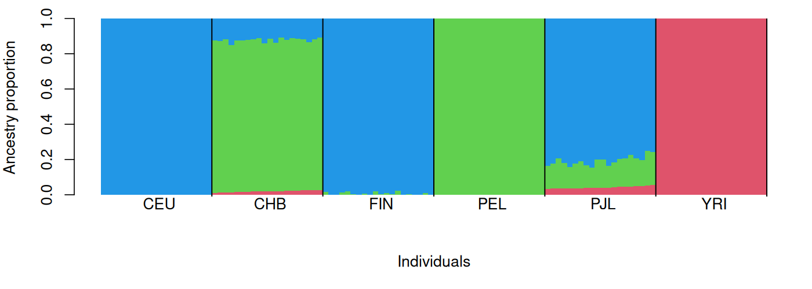

# ADMIXTURE tutorial

This tutorial estimates ancestry proportions from called genotypes using ADMIXTURE. It complements the NGSadmix tutorial, which uses genotype likelihoods from low-depth sequencing data.

## Learning goals

- Prepare called genotype data for ADMIXTURE.
- Apply basic genotype QC with a 5% MAF cutoff and 1% missing-genotype cutoff.
- Use PCAone to test HWE while accounting for population structure.
- Use PCAone ancestry-adjusted LD pruning before ancestry inference.
- Run ADMIXTURE for several values of `K` and several random seeds to check convergence.
- Plot ancestry proportions from ADMIXTURE `Q` files.
- Visualize the top 10 PCs as PC1 vs PC2, PC3 vs PC4, and so on.
- Use convergence checks and evalAdmix residuals, not cross-validation, to evaluate which `K` values are useful.

## Input data

This tutorial uses a called-genotype data set in PLINK binary format. The data set contains 120 individuals from six 1000 Genomes populations and 6,676,750 autosomal SNPs before filtering.

| Population | Description | Individuals |
| --- | --- | ---: |
| CEU | Utah residents with Northern/Western European ancestry | 20 |
| CHB | Han Chinese in Beijing | 20 |
| FIN | Finnish in Finland | 20 |
| PEL | Peruvian in Lima, Peru | 20 |
| PJL | Punjabi in Lahore, Pakistan | 20 |
| YRI | Yoruba in Ibadan, Nigeria | 20 |

Download the data into the local `data/` folder. The files are served from:

```text
https://popgen.dk/albrecht/open/tutorial_data/admixture/
```

## Set up folders and download data

Run all commands from the `admixture/` folder.

```bash
DATA_URL=https://popgen.dk/albrecht/open/tutorial_data/admixture

mkdir -p data results figures
```

Download the data if they are not already present:

```bash
bash code/00_download_data.sh
```

After installing the software in the folded section below, the complete tutorial can be run with:

```bash
bash code/01_run_admixture.sh
Rscript code/02_plot_admixture.R
```

<details>
<summary>Install software</summary>

ADMIXTURE documentation: https://dalexander.github.io/admixture/

PLINK documentation: https://www.cog-genomics.org/plink/

PCAone documentation: https://github.com/Zilong-Li/PCAone

Install locally under `software/`. Each block checks whether the executable is already present before downloading anything.

```bash
mkdir -p software

if [ ! -x software/dist/admixture_linux-1.3.0/admixture ]
then
  curl -L https://dalexander.github.io/admixture/binaries/admixture_linux-1.3.0.tar.gz \
    -o software/admixture_linux-1.3.0.tar.gz
  tar -xzf software/admixture_linux-1.3.0.tar.gz -C software
fi

if [ ! -x software/plink/plink ]
then
  curl -L https://s3.amazonaws.com/plink1-assets/plink_linux_x86_64_20241022.zip \
    -o software/plink_linux_x86_64_20241022.zip
  unzip -n software/plink_linux_x86_64_20241022.zip -d software/plink
fi

if [ ! -x software/PCAone ]
then
  curl -L https://github.com/Zilong-Li/PCAone/releases/latest/download/PCAone-Linux.zip \
    -o software/PCAone-Linux.zip
  unzip -n software/PCAone-Linux.zip -d software
  chmod +x software/PCAone
fi

ADMIXTURE=software/dist/admixture_linux-1.3.0/admixture
PLINK=software/plink/plink
PCAONE=software/PCAone

"${ADMIXTURE}" --help >/dev/null || true
"${PLINK}" --help >/dev/null || true
"${PCAONE}" --help >/dev/null || true
```

The same commands are collected in `code/00_install_software.sh`.

</details>

## Prepare input

### 1. Filter on MAF and missing genotypes

First inspect the input data and apply simple genotype filters. The MAF cutoff removes rare variants that are not informative for this small teaching example. The missingness cutoff removes SNPs with more than 1% missing genotypes. These thresholds are reasonable here, but they are not universal; choose them based on sample size, genotyping technology, and the downstream question.

```bash
mkdir -p results

PLINK=software/plink/plink

"${PLINK}" --bfile data/example \
  --maf 0.05 \
  --geno 0.01 \
  --make-bed \
  --out results/example.qc
```

<details>
<summary>Example stdout</summary>

```text
PLINK v1.9
6676750 variants loaded from .bim file.
120 people (0 males, 0 females, 120 ambiguous) loaded from .fam.
--geno: 0 variants removed due to missing genotype data.
--maf: 0 variants removed due to minor allele frequency threshold.
6676750 variants and 120 people pass filters and QC.
--make-bed to results/example.qc.bed + results/example.qc.bim + results/example.qc.fam ... done.
```

</details>

This data set has population structure, so we do not use PLINK for LD pruning. Standard LD estimates can be confounded by ancestry differences. Instead, we use PCAone to estimate PCs, test HWE while accounting for structure, and prune using ancestry-adjusted LD.

### 2. Estimate and visualize PCs with PCAone

First run PCAone and save the top 10 PCs and SNP loadings. The PCs are later plotted to show whether the sample labels match the major axes of structure.

```bash
PCAONE=software/PCAone

"${PCAONE}" -b results/example.qc -k 10 -V -o results/example.pcaone
```

<details>
<summary>Example stdout</summary>

```text
PCAone (v0.6.0)
N (# samples): 120, M (# SNPs): 6676750
running of epoch =  6, diff = 1.19257e-05
stops at epoch =  7
eigen vectors and values saved
PCAone - Randomized SVD done
total elapsed wall time: 118.371 seconds
```

</details>

For visualization, use `results/example.pcaone.eigvecs2`, not the raw eigenvector matrix. PCAone's `eigvecs2` file is the plotting-friendly output with sample IDs and PC columns. The `eigvecs` file is still part of the PCAone `--USV` prefix used below for HWE correction.

Run the plotting script after PCAone has finished:

```bash
Rscript code/02_plot_admixture.R
```


Figure 1. PCAone PC plots for PC1 vs PC2, PC3 vs PC4, PC5 vs PC6, PC7 vs PC8, and PC9 vs PC10. Points are colored by the population label in the `.fam` file. These plots check whether population labels agree with the main axes of genetic structure before ancestry inference.

### 3. HWE filtering and ancestry-adjusted LD pruning

Next use the PCAone PCs/loadings to test HWE while accounting for population structure. The `.hwe` file contains one row per SNP, including an HWE P value and inbreeding coefficient. Here we keep SNPs with HWE P value at least `1e-6`; this threshold also depends on the data set and study design.

```bash
"${PCAONE}" -b results/example.qc \
  --USV results/example.pcaone \
  -k 10 \
  --inbreed 1 \
  -o results/example.hwe

awk 'NR > 1 && $2 >= 1e-6 {print $1}' results/example.hwe.hwe > results/example.hwe.keep
```

Now compute ancestry-adjusted LD and prune SNPs with `r2 > 0.2` within 1 Mb. PCAone writes `results/example.adjld.ld.prune.in`, the SNPs retained after adjusted-LD pruning.

```bash
"${PCAONE}" -b results/example.qc -k 10 --ld -o results/example.adjld

"${PCAONE}" -B results/example.adjld.residuals \
  --match-bim results/example.adjld.mbim \
  --ld-r2 0.2 \
  --ld-bp 1000000 \
  -o results/example.adjld
```

Finally, intersect the HWE-passing SNPs with the PCAone LD-pruned SNPs and create the PLINK data set used by ADMIXTURE.

```bash
awk '{print $2}' results/example.adjld.ld.prune.in > results/example.adjld.ld.prune.ids

grep -Fxf results/example.adjld.ld.prune.ids results/example.hwe.keep > results/example.keep.snps

"${PLINK}" --bfile results/example.qc \
  --extract results/example.keep.snps \
  --make-bed \
  --out results/example.pcaone_pruned
```

<details>
<summary>Example stdout</summary>

```text
PCAone --inbreed 1
N (# samples): 120, M (# SNPs): 6676750
run inbreeding coefficient estimator
EM inbreeding coefficient coverged
compute the LRT test
Output: results/example.hwe.hwe
6652351 SNPs pass HWE P >= 1e-6

PCAone adjusted LD pruning
shape of input matrix (features x samples) is 6676750x 120
LD pruning, choose sites to be kept randomly or with high MAF? 1(random) : 0(high MAF). =>  0
Output: results/example.adjld.ld.prune.in
Output: results/example.adjld.ld.prune.out
265731 SNPs retained after ancestry-adjusted LD pruning
256171 SNPs remain after intersecting the HWE and LD-pruned lists

PLINK v1.9
6676750 variants loaded from .bim file.
120 people (0 males, 0 females, 120 ambiguous) loaded from .fam.
--extract: 256171 variants remaining.
256171 variants and 120 people pass filters and QC.
--make-bed to results/example.pcaone_pruned.bed + results/example.pcaone_pruned.bim + results/example.pcaone_pruned.fam ... done.
```

</details>

## Run ADMIXTURE

Run ADMIXTURE for several values of `K` and several independent random seeds. Different seeds can converge to different optima, especially for larger `K`, so we inspect convergence before interpreting the ancestry proportions.

```bash
ADMIXTURE=software/dist/admixture_linux-1.3.0/admixture

for K in 2 3 4 5
do
  for SEED in $(seq 1 10)
  do
    QOUT="results/example.pcaone_pruned.K${K}.seed${SEED}.Q"
    POUT="results/example.pcaone_pruned.K${K}.seed${SEED}.P"
    if [ -s "${QOUT}" ] && [ -s "${POUT}" ]
    then
      echo "Skipping K=${K} seed=${SEED}; output already exists."
      continue
    fi

    "${ADMIXTURE}" -s "${SEED}" results/example.pcaone_pruned.bed "${K}" \
      | tee "results/admixture.K${K}.seed${SEED}.log"

    mv "example.pcaone_pruned.${K}.Q" "${QOUT}"
    mv "example.pcaone_pruned.${K}.P" "${POUT}"
  done
done
```

The full input-preparation and ADMIXTURE workflow is also in `code/01_run_admixture.sh`. It checks for existing output files before running each step.

<details>
<summary>Example stdout</summary>

```text
ADMIXTURE Version 1.3.0
Random seed: 1
Size of G: 120x256171
Converged in 16 iterations (50.313 sec)
Loglikelihood: -26251070.702720
Fst divergences between estimated populations:
        Pop0    Pop1
Pop0
Pop1    0.207
Pop2    0.172   0.100
Writing output files.
```

</details>

Do not choose the meaningful `K` from cross-validation error. Use convergence across seeds, ancestry plots, and evalAdmix residuals.

## Explain the output

ADMIXTURE writes ancestry proportions and component-specific allele frequencies.

| File | What it contains | Used for |
| --- | --- | --- |
| `results/example.qc.*` | PLINK data after MAF and missingness filtering. | PCAone input |
| `results/example.pcaone.eigvecs2` | Sample coordinates for the top 10 PCs. | PCA plots |
| `results/example.hwe.hwe` | PCAone HWE P values and inbreeding coefficients per SNP. | HWE filtering |
| `results/example.adjld.ld.prune.in` | SNPs retained by PCAone ancestry-adjusted LD pruning. | SNP filtering |
| `results/example.pcaone_pruned.K3.seed1.Q` | One row per individual and one column per ancestry component. | Ancestry barplot |
| `results/example.pcaone_pruned.K3.seed1.P` | Allele-frequency estimates for each ancestry component. | Model parameters |
| `results/admixture.K3.seed1.log` | Runtime information and likelihood messages. | Checking convergence across seeds |

The `.Q` file gives the ancestry barplot. The `.log` files should be inspected across independent seeds before interpreting a run. The PCAone `.eigvecs2` file is used to visualize PC1 vs PC2, PC3 vs PC4, PC5 vs PC6, PC7 vs PC8, and PC9 vs PC10.

## Visualizations

Run the plotting script:

```bash
Rscript code/02_plot_admixture.R
```



Figure 2. ADMIXTURE ancestry barplot for `K=3`. Each vertical bar is one individual, and colors show inferred ancestry components. This PNG is generated from `results/example.pcaone_pruned.K3.seed1.Q` by `code/02_plot_admixture.R`.


Figure 3. Convergence summary across seeds and K values. Each point shows the final loglikelihood difference from the best seed for that `K`; values near zero indicate repeated convergence to the same optimum. The meaningful `K` is not chosen from cross-validation error; the tutorial should compare convergence, ancestry plots, and evalAdmix residual correlations.

The full plotting code is in `code/02_plot_admixture.R`. It writes:

- `figures/admixture_k3.png`
- `figures/admixture_convergence.png`
- `figures/pcaone_top10_pc_pairs.png`

## Interpret the result

Compare `K` values using convergence across seeds, ancestry barplots, and evalAdmix residual correlations. ADMIXTURE assumes called genotypes, while NGSadmix is designed for genotype likelihoods and is therefore better suited to low-depth sequencing data.

## Sources

- https://dalexander.github.io/admixture/
- https://www.cog-genomics.org/plink/
- https://github.com/Zilong-Li/PCAone
