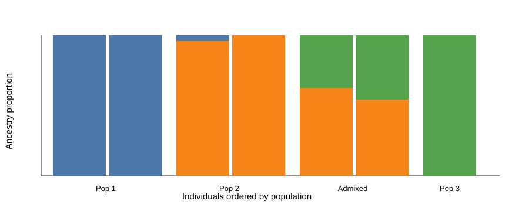
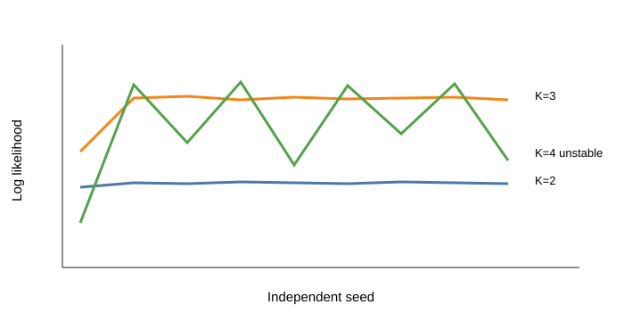

# ADMIXTURE tutorial

This tutorial estimates ancestry proportions from called genotypes using ADMIXTURE. It complements the NGSadmix tutorial, which uses genotype likelihoods from low-depth sequencing data.

## Learning goals

- Prepare PLINK input for ADMIXTURE.
- LD prune genotype data before ancestry inference.
- Run ADMIXTURE for several values of `K`.
- Plot ancestry proportions from ADMIXTURE `Q` files.
- Compare genotype-based ADMIXTURE output with NGSadmix-style output.

## Input data

The final tutorial should use a PLINK binary data set downloaded into the local `data/` folder. The files are served from:

```text
https://popgen.dk/albrecht/open/tutorial_data/admixture/
```

Course material to mine for commands and data choices:

- https://github.com/popgenDK/courses/blob/main/summer2025/exercises/Day3_Admixture_structure_bonus.ipynb
- https://github.com/popgenDK/courses/blob/main/bgi23/Admixture.ipynb
- https://github.com/popgenDK/courses/blob/main/chinaCourse2025/Day4_Morning_admixture_genotype.ipynb

## Set paths

Run all commands from the `admixture/` folder.

```bash
DATA_URL=https://popgen.dk/albrecht/open/tutorial_data/admixture

THREADS=${THREADS:-4}
mkdir -p data results figures
```

Download the data if they are not already present:

```bash
mkdir -p data
wget -nc -P data "${DATA_URL}/example.bed"
wget -nc -P data "${DATA_URL}/example.bim"
wget -nc -P data "${DATA_URL}/example.fam"
```

<details>
<summary>Install software</summary>

ADMIXTURE documentation: https://dalexander.github.io/admixture/

PLINK documentation: https://www.cog-genomics.org/plink/

Install locally under `../software/`:

```bash
SOFTWARE_DIR=../software
mkdir -p "${SOFTWARE_DIR}"
cd "${SOFTWARE_DIR}"

wget -nc https://dalexander.github.io/admixture/binaries/admixture_linux-1.3.0.tar.gz
tar -xzf admixture_linux-1.3.0.tar.gz

wget -nc https://s3.amazonaws.com/plink1-assets/plink_linux_x86_64_20241022.zip
unzip -n plink_linux_x86_64_20241022.zip -d plink

cd -
export PATH="$(pwd)/${SOFTWARE_DIR}/admixture_linux-1.3.0:$(pwd)/${SOFTWARE_DIR}/plink:${PATH}"

which admixture
admixture --help | head

which plink
plink --help | head
```

</details>

## Prepare input

Start by checking the input data.

```bash
plink --bfile data/example --freq --out results/example.freq
plink --bfile data/example --missing --out results/example.missing
```

This data set has population structure, so we do not use PLINK for LD pruning. Standard LD estimates can be confounded by ancestry differences. Instead, use PCAone for LD estimation and pruning, then use the retained SNPs for ADMIXTURE.

```bash
# Placeholder: replace with the PCAone LD-pruning command once the example data are finalized.
# The output should be a PLINK prefix named results/example.pcaone_pruned.
```

## Run ADMIXTURE

```bash
for K in 2 3 4 5
do
  admixture results/example.pcaone_pruned.bed "${K}" \
    | tee "results/admixture.K${K}.log"

  mv "example.pcaone_pruned.${K}.Q" "results/example.pcaone_pruned.K${K}.Q"
  mv "example.pcaone_pruned.${K}.P" "results/example.pcaone_pruned.K${K}.P"
done
```

Run several seeds for each `K` in the final tutorial and compare the log likelihoods. Do not choose the meaningful `K` from cross-validation error. Use convergence across seeds, ancestry plots, and evalAdmix residuals.

## Explain the output

ADMIXTURE writes ancestry proportions and component-specific allele frequencies.

| File | What it contains | Used for |
| --- | --- | --- |
| `results/example.pcaone_pruned.K3.Q` | One row per individual and one column per ancestry component. | Ancestry barplot |
| `results/example.pcaone_pruned.K3.P` | Allele-frequency estimates for each ancestry component. | Model parameters |
| `results/admixture.K3.log` | Runtime information and likelihood messages. | Checking whether runs behaved as expected |

The `.Q` file gives the ancestry barplot. The `.log` files should be inspected across independent seeds before interpreting a run.

## Visualizations

Run the plotting script:

```bash
Rscript code/02_plot_admixture.R
```



Figure 1. Draft ADMIXTURE ancestry barplot for `K=3`. Each vertical bar is one individual, and colors show inferred ancestry components. The final PNG version is generated from `results/example.pcaone_pruned.K3.Q` by `code/02_plot_admixture.R`.



Figure 2. Draft convergence summary across seeds and K values. The meaningful `K` is not chosen from cross-validation error; the tutorial should compare convergence, ancestry plots, and evalAdmix residual correlations.

Save this as `code/02_plot_admixture.R` and run it from `admixture/`.

```r
data_dir <- "data"
results_dir <- "results"
figures_dir <- "figures"

q <- read.table(file.path(results_dir, "example.pcaone_pruned.K3.Q"))

fam_file <- file.path(results_dir, "example.pcaone_pruned.fam")
if (!file.exists(fam_file)) {
  fam_file <- file.path(data_dir, "example.fam")
}
fam <- read.table(fam_file, as.is = TRUE)

pop <- fam[, 1]
ord <- order(pop, q[, 1])

png(file.path(figures_dir, "admixture_k3.png"), width = 1400, height = 500, res = 160)
par(mar = c(5, 4, 1, 1))
barplot(
  t(q)[, ord],
  col = 2:10,
  space = 0,
  border = NA,
  xlab = "Individuals",
  ylab = "Ancestry proportion"
)
text(sort(tapply(seq_len(nrow(fam)), pop[ord], mean)), -0.05, unique(pop[ord]), xpd = TRUE)
abline(v = cumsum(sapply(unique(pop[ord]), function(x) sum(pop[ord] == x))), col = 1, lwd = 1.2)
dev.off()
```

## Interpret the result

The tutorial should make users compare `K` values using convergence across seeds, ancestry barplots, and evalAdmix residual correlations. It should also mention that ADMIXTURE assumes called genotypes, while NGSadmix is designed for genotype likelihoods and is therefore better suited to low-depth sequencing data.

## Sources

- https://github.com/popgenDK/courses/blob/main/summer2025/exercises/Day3_Admixture_structure_bonus.ipynb
- https://github.com/popgenDK/courses/blob/main/bgi23/Admixture.ipynb
- https://github.com/popgenDK/courses/blob/main/chinaCourse2025/Day4_Morning_admixture_genotype.ipynb
- https://dalexander.github.io/admixture/
- https://www.cog-genomics.org/plink/
