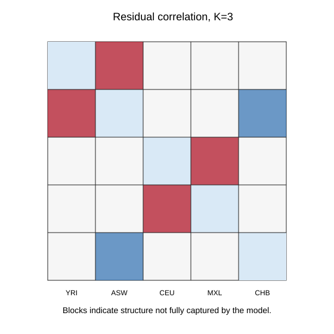

# evalAdmix tutorial

This tutorial evaluates admixture model fit using evalAdmix. It is designed to follow either the `ngsadmix/` tutorial or an ADMIXTURE tutorial with compatible `Q`, allele-frequency, and genotype/genotype-likelihood input files.

## Learning goals

- Run evalAdmix on an ancestry model.
- Generate a correlation-of-residuals plot.
- Use residual structure to decide whether a chosen `K` is adequate.
- Compare model fit across `K=3` and `K=4`.

## Input data

This starter tutorial assumes the NGSadmix tutorial produced:

- `../ngsadmix/results/1000G5pops.ngsadmix.K3.seed3.qopt`
- `../ngsadmix/results/1000G5pops.ngsadmix.K3.seed3.fopt.gz`
- `../ngsadmix/data/1000G5pops.inputgl.beagle.gz`
- `../ngsadmix/data/1000G5pops.pop.info`

Relevant course source:

- https://github.com/popgenDK/courses/blob/main/summer2025/exercises/Day3_Morning_Admixture.ipynb

## Set paths

Run all commands from the `evaladmix/` folder. If using outputs from `ngsadmix/`, point `NGSADMIX_DIR` at that folder.

```bash
DATA_URL=https://popgen.dk/albrecht/open/tutorial_data/ngsadmix

THREADS=${THREADS:-4}
mkdir -p data results figures

BEAGLE=../ngsadmix/data/1000G5pops.inputgl.beagle.gz
POPINFO=../ngsadmix/data/1000G5pops.pop.info
QOPT=../ngsadmix/results/1000G5pops.ngsadmix.K3.seed3.qopt
FOPT=../ngsadmix/results/1000G5pops.ngsadmix.K3.seed3.fopt.gz
```

Download the shared NGSadmix data if they are not already present:

```bash
mkdir -p ../ngsadmix/data
wget -nc -P ../ngsadmix/data "${DATA_URL}/1000G5pops.inputgl.beagle.gz"
wget -nc -P ../ngsadmix/data "${DATA_URL}/1000G5pops.pop.info"
```

<details>
<summary>Install software</summary>

evalAdmix repository: https://github.com/GenisGE/evalAdmix

Install locally under `../software/`:

```bash
SOFTWARE_DIR=../software
git clone https://github.com/GenisGE/evalAdmix.git "${SOFTWARE_DIR}/evalAdmix"
cd "${SOFTWARE_DIR}/evalAdmix"
make
cd -
export PATH="$(pwd)/${SOFTWARE_DIR}/evalAdmix:${PATH}"

which evalAdmix
evalAdmix 2>&1 | head
```

The plotting functions used by the course material are available from:

```r
source("https://raw.githubusercontent.com/GenisGE/evalAdmix/master/visFuns.R")
```

</details>

## Run evalAdmix

```bash
evalAdmix \
  -beagle "${BEAGLE}" \
  -fname "${FOPT}" \
  -qname "${QOPT}" \
  -o "results/1000G5pops.K3.seed3.corres" \
  -P "${THREADS}"
```

## Explain the output

evalAdmix writes a residual-correlation matrix.

| File | What it contains | Used for |
| --- | --- | --- |
| `results/1000G5pops.K3.seed3.corres` | Pairwise correlation of residuals between individuals after fitting the ancestry model. | Residual heatmap and model checking |

Positive residual correlation means two individuals are more genetically similar than expected under the fitted model. Blocks of residual correlation often indicate structure that is not captured by the chosen `K` or by the reference populations.

## Visualizations

Run the plotting script:

```bash
Rscript code/02_plot_evaladmix.R
```



Figure 1. Draft evalAdmix residual-correlation heatmap. Red and blue blocks mark pairs of individuals that are more or less similar than expected under the fitted model. The final PNG version is generated from `results/1000G5pops.K3.seed3.corres` by `code/02_plot_evaladmix.R`.

Save this as `code/02_plot_evaladmix.R` and run it from `evaladmix/`.

```r
source("https://raw.githubusercontent.com/GenisGE/evalAdmix/master/visFuns.R")

data_dir <- "../ngsadmix/data"
ngsadmix_results_dir <- "../ngsadmix/results"
results_dir <- "results"
figures_dir <- "figures"

pop <- read.table(file.path(data_dir, "1000G5pops.pop.info"), as.is = TRUE)
q <- read.table(file.path(ngsadmix_results_dir, "1000G5pops.ngsadmix.K3.seed3.qopt"))
r <- as.matrix(read.table(file.path(results_dir, "1000G5pops.K3.seed3.corres")))

ord <- orderInds(pop = pop[, 1], q = q)

png(file.path(figures_dir, "evaladmix_k3_residuals.png"), width = 900, height = 800, res = 150)
plotCorRes(r, pop = pop[, 1], ord = ord, max_z = 0.2)
dev.off()
```

## Interpret the result

The final tutorial should explain that large blocks of positive or negative residual correlation can indicate structure not captured by the chosen admixture model. Users should compare residual plots across `K` values rather than treating the ancestry barplot alone as proof of a good model.

## Sources

- https://github.com/popgenDK/courses/blob/main/summer2025/exercises/Day3_Morning_Admixture.ipynb
- https://github.com/GenisGE/evalAdmix
