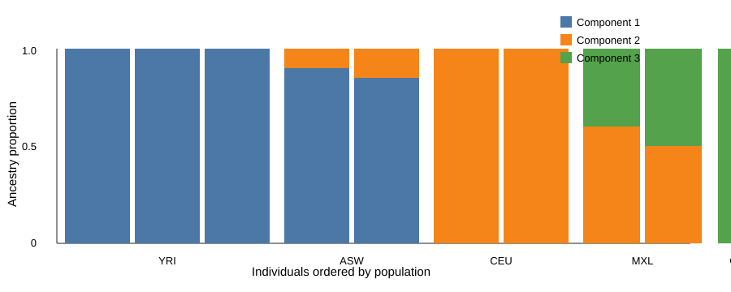
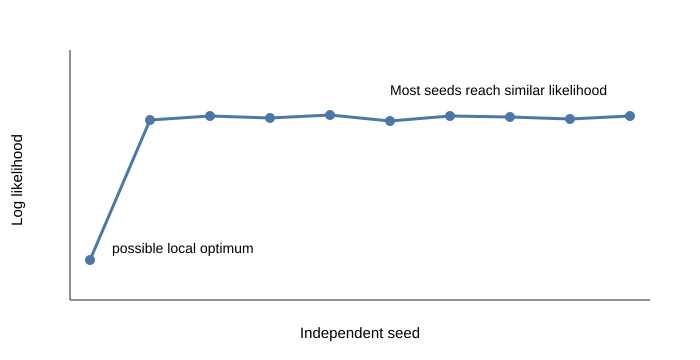

# NGSadmix tutorial

This tutorial estimates ancestry proportions from genotype likelihoods using NGSadmix. It is adapted from the population-structure exercises in `popgenDK/courses`, especially `advBinf/exercises/admixture.md` and `summer2025/exercises/Day3_Morning_Admixture.ipynb`.

## Learning goals

- Create or inspect Beagle-format genotype likelihood input.
- Run NGSadmix for one or more values of `K`.
- Compare repeated runs using log likelihoods.
- Plot ancestry proportions and save the figure from reproducible R code.

## Input data

The course tutorials use low-depth 1000 Genomes data from ASW, CEU, CHB, YRI, and MXL. Download the tutorial data into the local `data/` folder. The files are served from:

```text
https://popgen.dk/albrecht/open/tutorial_data/ngsadmix/
```

Relevant course sources:

- https://github.com/popgenDK/courses/blob/main/advBinf/exercises/admixture.md
- https://github.com/popgenDK/courses/blob/main/summer2025/exercises/Day3_Morning_Admixture.ipynb

## Set paths

Run all commands from the `ngsadmix/` folder.

```bash
DATA_URL=https://popgen.dk/albrecht/open/tutorial_data/ngsadmix

THREADS=${THREADS:-4}
mkdir -p data results figures

BEAGLE=data/1000G5pops.inputgl.beagle.gz
POPINFO=data/1000G5pops.pop.info
```

Download the data if they are not already present:

```bash
mkdir -p data
wget -nc -P data "${DATA_URL}/1000G5pops.inputgl.beagle.gz"
wget -nc -P data "${DATA_URL}/1000G5pops.pop.info"
```

<details>
<summary>Install software</summary>

NGSadmix documentation: https://popgen.dk/software/index.php/NgsAdmix

Install locally under `../software/`:

```bash
SOFTWARE_DIR=../software
mkdir -p "${SOFTWARE_DIR}/ngsadmix"
cd "${SOFTWARE_DIR}/ngsadmix"

wget -nc http://www.popgen.dk/software/download/NGSadmix/NGSadmix32.cpp
g++ -O3 NGSadmix32.cpp -lz -o NGSadmix

cd -
export PATH="$(pwd)/${SOFTWARE_DIR}/ngsadmix:${PATH}"

which NGSadmix
NGSadmix 2>&1 | head
```

If starting from BAM files, ANGSD is also needed to generate Beagle-format genotype likelihoods:

```bash
SOFTWARE_DIR=../software
git clone https://github.com/ANGSD/angsd.git "${SOFTWARE_DIR}/angsd"
cd "${SOFTWARE_DIR}/angsd"
make
cd -
export PATH="$(pwd)/${SOFTWARE_DIR}/angsd:${PATH}"

which angsd
angsd --help 2>&1 | head
```

</details>

## Inspect genotype likelihood input

```bash
zcat "${BEAGLE}" | wc -l
zcat "${BEAGLE}" | head -n 7 | cut -f1-9 | column -t
cut -f 1 -d " " "${POPINFO}" | sort | uniq -c
```

## Run NGSadmix

Run several seeds for a fixed `K`. The tutorial should start with `K=3` and then repeat with `K=4`.

```bash
K=3

for SEED in $(seq 1 20)
do
  NGSadmix \
    -likes "${BEAGLE}" \
    -K "${K}" \
    -P "${THREADS}" \
    -minMaf 0.05 \
    -seed "${SEED}" \
    -o "results/1000G5pops.ngsadmix.K${K}.seed${SEED}"
done
```

## Pick the best run

```bash
K=3
rm -f "results/ngsadmix.K${K}.likes"

for SEED in $(seq 1 20)
do
  grep "best like" "results/1000G5pops.ngsadmix.K${K}.seed${SEED}.log" \
    | awk -v seed="${SEED}" '{print seed, $NF}' \
    >> "results/ngsadmix.K${K}.likes"
done

sort -k2,2gr "results/ngsadmix.K${K}.likes"
```

## Explain the output

NGSadmix writes three main output files for each run.

| File | What it contains | Used for |
| --- | --- | --- |
| `results/1000G5pops.ngsadmix.K3.seed3.qopt` | One row per individual and one column per ancestry component. Rows are in the same order as the input samples. | Ancestry barplot |
| `results/1000G5pops.ngsadmix.K3.seed3.fopt.gz` | Allele-frequency estimates for each site and ancestry component. | Model parameters and evalAdmix |
| `results/1000G5pops.ngsadmix.K3.seed3.log` | Runtime information, likelihood, and convergence messages. | Choosing the best run among seeds |
| `results/ngsadmix.K3.likes` | Log likelihood summary across seeds. | Convergence check |

The `.qopt` file is the file most people inspect first, but the log likelihoods across seeds should be checked before interpreting the ancestry plot.

## Visualizations

Run the plotting script:

```bash
Rscript code/02_plot_ngsadmix.R
```



Figure 1. Draft NGSadmix ancestry barplot for `K=3`. Each vertical bar is one individual, and colors show inferred ancestry components. The final PNG version is generated from `results/1000G5pops.ngsadmix.K3.seed3.qopt` by `code/02_plot_ngsadmix.R`.



Figure 2. Draft convergence summary across independent seeds. Runs with similar likelihoods likely found the same optimum; an outlying seed can indicate a local optimum and should not be used for interpretation.

Save this as `code/02_plot_ngsadmix.R` and run it from `ngsadmix/`.

```r
source("https://raw.githubusercontent.com/GenisGE/evalAdmix/master/visFuns.R")

data_dir <- "data"
results_dir <- "results"
figures_dir <- "figures"

pop <- read.table(file.path(data_dir, "1000G5pops.pop.info"), as.is = TRUE)
q <- read.table(file.path(results_dir, "1000G5pops.ngsadmix.K3.seed3.qopt"))

ord <- orderInds(pop = pop[, 1], q = q)

png(file.path(figures_dir, "ngsadmix_k3.png"), width = 1400, height = 500, res = 160)
par(mar = c(5, 4, 1, 1))
barplot(
  t(q)[, ord],
  col = 2:10,
  space = 0,
  border = NA,
  xlab = "Individuals",
  ylab = "Admixture proportions"
)
text(sort(tapply(seq_len(nrow(pop)), pop[ord, 1], mean)), -0.05, unique(pop[ord, 1]), xpd = TRUE)
abline(v = cumsum(sapply(unique(pop[ord, 1]), function(x) sum(pop[ord, 1] == x))), col = 1, lwd = 1.2)
dev.off()
```

## Interpret the result

The final tutorial should ask users to compare the inferred clusters with the population labels, identify admixed populations, and explain why more sites usually give cleaner ancestry profiles.

## Sources

- https://github.com/popgenDK/courses/blob/main/advBinf/exercises/admixture.md
- https://github.com/popgenDK/courses/blob/main/summer2025/exercises/Day3_Morning_Admixture.ipynb
- https://popgen.dk/software/index.php/NgsAdmix
